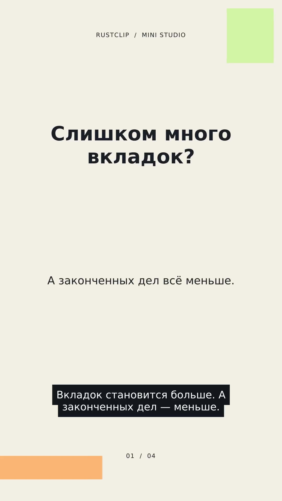

# RustClip Studio

Локальная мини-студия на Rust: найти интересную тему, написать собственный сценарий, собрать ролик, подготовить публикацию и учесть результат. Каждый шаг записывается в граф причин, состояний, областей действия и времени.

Это работающая первая версия для одного пользователя. Рендер и шаблоны работают на CPU без платных облачных сервисов. Автоматические подключения к площадкам требуют ваших разрешений и действующих токенов.

## Посмотреть и послушать

Демонстрационный ролик «Один ясный шаг»: **28,02 секунды, 1080×1920**, анимированные титры, субтитры и русская нейросетевая озвучка **Piper Denis**. Собран локально на CPU.

<a href="examples/demo/rustclip-studio-demo-denis.mp4"></a>

- [Открыть готовый ролик · MP4](examples/demo/rustclip-studio-demo-denis.mp4)
- [Послушать звуковую дорожку · MP3](examples/demo/rustclip-studio-voice-denis.mp3)
- [Хеши файлов, проверка декодирования и причинный журнал](docs/verification/README.md)

Это пример рендера и голоса; просмотры, публикация в соцсетях и заработок для него не заявлены. MP4 совпадает по SHA256 с сохранённым протоколом рендера: `3ef8de47d8b49722cb9fdad293b83cb486d869a61f9065e0a72904c98050f6e7`.

## История исходников

Первичная история разработки до упаковки портфолио сохранена в [Git bundle](docs/source-history.bundle). Это позволяет восстановить локальные коммиты, указанные в протоколах проверок, даже если загрузка в GitHub создала отдельные коммиты публикации:

```bash
git clone --branch main docs/source-history.bundle ../rustclip-studio-history
```

## Что уже работает

| Возможность | Реализация | Что требуется |
|---|---|---|
| Интерфейс студии | Проекты, сцены, материалы, предпросмотр, очередь, граф, экономика | Браузер и запущенный локальный сервер |
| Поиск тем | Google Trends RSS; YouTube `mostPopular` | Для Google — интернет; для YouTube — `YOUTUBE_API_KEY` |
| Черновик сценария | Оригинальный шаблон из четырёх сцен; опционально локальный Ollama | Шаблон без модели; Ollama устанавливается отдельно |
| Видео | Анимированные титры, свои фото/видео, голос, своя музыка, MP4, постер, SRT | FFmpeg с `libx264` и `libass`, ffprobe |
| Форматы | 9:16 — Shorts/Reels/TikTok/VK; 16:9; 1:1 | Выбрать профиль и отрендерить соответствующую ревизию |
| Озвучка | eSpeak, Piper или без голоса; русский и английский | Локальный движок; для Piper также модель |
| Экспорт для любых сетей | MP4, подпись, метаданные, субтитры | Ручная загрузка в нужную сеть |
| Отправка через API | YouTube и Telegram | OAuth YouTube или бот Telegram с доступом к целевому чату |
| Отложенная отправка | Локальная очередь с привязкой к версии и SHA256 ролика | Процесс студии должен оставаться запущенным |
| Автоконвейер | Свежий сигнал → оригинальный черновик → рендер → экспорт/адаптер; ограниченные повторные циклы | Настроить свой ракурс, бюджет и режим; оставить процесс запущенным |
| Экономика | Дневные показатели вручную/CSV; YouTube Analytics; прогноз и подтверждённая выручка отдельно | Данные пользователя; аналитике YouTube нужен OAuth |
| Причинный граф | Типизированные зависимости, гипотезы, исправления, два времени, исторические снимки | Локальный журнал SQLite |

TikTok, Reels и VK пока поддерживаются через экспорт. Студия получает метаданные трендов, а ролики строит из вашего сценария и ваших материалов. Она не скачивает чужие клипы и не копирует их монтаж. Популярная тема и автоматизация сами по себе не гарантируют просмотры или монетизацию.

## Быстрый старт на Windows

1. Установите [Rust через rustup](https://rust-lang.org/tools/install/). При запросе установщика добавьте MSVC C++ Build Tools. Проверенная версия Rust — **1.99.0**, закреплена в репозитории.
2. Установите FFmpeg и ffprobe из сборки, указанной на [странице FFmpeg](https://ffmpeg.org/download.html). Нужны фильтр `ass` и кодек `libx264`.
3. Для русской нейросетевой озвучки настройте **Piper + Denis** по [инструкции для Windows/Linux](docs/voice.md). Он работает локально на CPU. Более простой вариант — [eSpeak NG](https://github.com/espeak-ng/espeak-ng) или режим «Без голоса». Для кириллицы установите шрифт DejaVu Sans; libass может выбрать доступный системный шрифт.
4. Откройте PowerShell в папке проекта. Скопируйте настройки:

```powershell
Copy-Item .env.example .env
```

В `.env` укажите **реальные пути к `.exe`**: `RUSTCLIP_FFMPEG`, `RUSTCLIP_FFPROBE`, при необходимости `RUSTCLIP_ESPEAK`. Примеры путей находятся в файле. Затем:

```powershell
cargo run --release -- doctor
cargo run --release -- demo
cargo run --release -- serve
```

Откройте **http://127.0.0.1:3939**. В интерфейсе нажмите «Демо +» или «Новый ролик», проверьте сценарий, выберите голос и запустите рендер. Для первой доставки оставьте «Проверочный запуск»: он создаст пакет без отправки в сеть.

Windows-инструкция описывает поддерживаемые пути и команды; сборка и реальный рендер этой версии проверены на Linux, отдельного Windows CI пока нет.

### Ubuntu / Debian

После установки Rust:

```bash
sudo apt-get update
sudo apt-get install -y ffmpeg espeak-ng fonts-dejavu-core
cp .env.example .env
cargo run --release -- doctor
cargo run --release -- demo
cargo run --release -- serve
```

GPU не нужен. Для русской нейросетевой озвучки рекомендуем начать с **Piper 1.8.0 + `ru_RU-denis-medium`**: модель около 63 МБ, локальная генерация на CPU, датасет CC0. [Установка, настройка путей и отдельные лицензии движка/модели](docs/voice.md). eSpeak остаётся доступным, но звучит механически.

`demo` и кнопка «Демо +» выбирают Piper, если найдены движок, модель и конфигурация с подходящим языком; затем eSpeak, а при отсутствии обоих — режим без голоса. `demo --silent` всегда создаёт тихий пример. Выбранный вами голос в существующем проекте не меняется автоматически: для него выберите **Piper** и запустите новый рендер. Голосовые модели в репозиторий не входят.

### Локальный сценарист Ollama

Установите [Ollama](https://ollama.com), запустите его и загрузите модель:

```bash
ollama pull qwen2.5:3b
```

В интерфейсе выберите «Ollama · локальная модель». По умолчанию используются `http://127.0.0.1:11434` и `qwen2.5:3b`; изменить их можно в `.env`. Разрешён только локальный адрес. Если модель недоступна или вернула неверную структуру, студия покажет ошибку. Ссылки на источники сохраняются, но модель не читает их содержимое: факты и собственный пример проверяет автор.

## Автоконвейер

В разделе **«Автоконвейер»** задайте собственный ракурс, регион, формат, голос и доставку. Нажмите **«Один цикл»**: студия обновит сигналы, выберет ещё не использованную тему, создаст сценарий, соберёт видео и выполнит проверочный экспорт. Результат, ошибки и созданные проекты появятся в отчёте. Для повторения отметьте **«Включить повторные циклы по расписанию»** и нажмите **«Сохранить настройки»**.

Начните с **экспорта и включённого проверочного режима**. Это значение используется в [examples/autopilot.json](examples/autopilot.json). Живая отправка возможна только при явном выборе YouTube/Telegram, отключённой проверке и настроенном адаптере. Шаблон остаётся редактируемым каркасом: автоцикл не подтверждает новости и не обещает вирусный ролик. Перед публичной отправкой проверьте свой сценарий и материалы.

| Параметр | Значение по умолчанию | Граница |
|---|---|---|
| `limit` | 1 новый проект за цикл | 1–3 |
| `daily_budget` | 2 новых проекта за день | 1–10 |
| `interval_minutes` | 60 минут после завершения цикла | 15–1440 |
| `utc_offset_hours` | +3 — календарный день Москвы/Турции | −12…+14, фиксированное смещение |

Суточный бюджет учитывает **все** новые проекты в папке данных, включая ручные, черновики и неудачные рендеры. Существующая тема пропускается по точному совпадению текста после удаления пробелов по краям, даже если прежний проект не завершён. Это защита от повторов, а не поиск смысловых дублей.

Конфигурация сервера сохраняется в `data/autopilot.json` и загружается при следующем запуске. Выключение повторных циклов предотвращает следующие запуски; текущий цикл не превращается в отменённую отправку. Студия должна работать: закрытый процесс не выполняет расписание. YouTube Analytics импортируется отдельно через раздел экономики; автоцикл пока не синхронизирует доходы сам.

CLI позволяет запустить тот же конвейер при остановленном сервере:

```bash
cargo run --release -- pipeline examples/autopilot.json
cargo run --release -- pipeline examples/autopilot.json --watch
```

Первая команда выполняет один цикл и печатает отчёт; вторая повторяет ограниченные циклы последовательно. `Ctrl+C` в `--watch` завершает работу после текущего цикла. Для просмотра результатов затем запустите `serve`. Одновременно `--watch` и `serve` с одной папкой данных не работают; встроенный автоконвейер в интерфейсе позволяет автоматизировать и смотреть результаты в одном процессе.

## Команды

Все команды принимают глобальный `--data`. По умолчанию данные находятся в `data/`; альтернатива — переменная `RUSTCLIP_DATA`.

Одна папка данных принадлежит одному работающему процессу: эксклюзивная файловая блокировка предотвращает запуск второго владельца. Пока работает `serve`, используйте интерфейс или его API. Перед CLI-командами с той же папкой остановите сервер (`Ctrl+C`); независимую студию можно запустить с другим `--data`.

```bash
cargo run --release -- --data ./my-studio serve --port 3939
```

Следующие команды запускайте при остановленном сервере для выбранной папки:

```bash
cargo run --release -- trends --source google --region TR
cargo run --release -- render examples/one-clear-step.json
cargo run --release -- graph --output ./graph.json
cargo run --release -- import-ledger ./ledger.csv
```

Для экспорта готового проекта подставьте его UUID из интерфейса:

```bash
cargo run --release -- publish PROJECT_UUID --platform export
```

`publish` по умолчанию выполняет проверочный запуск. Реальную отправку включает `--live`, например `--platform youtube --privacy private --live`. [Настройка площадок и ограничения](docs/platforms.md) описаны отдельно. Опция `scheduled_at` доступна через интерфейс/API и задаёт время запуска локальной очереди, а не отложенный выпуск на сервере YouTube.

## Данные и экономика

В `data/studio.sqlite3` хранятся проекты, очередь, дневной журнал показателей и события. Материалы находятся в `data/assets/`; рендеры — в `data/renders/`; пакеты для публикации — в `data/exports/`. Сохраняйте всю папку данных. `.env`, файлы данных и сборки исключены из Git.

Сценарий нельзя менять во время активного рендера или отправки. После завершения операции правка создаёт новую ревизию, для которой потребуется новый рендер.

В журнал вносятся **просмотры за один день**, а не накопленный счётчик. Денежные поля CSV/API заданы в минимальных единицах валюты: 100 копеек = 1 ₽, 100 центов = 1 USD/EUR. Поля: `project_id,platform,date,views,currency,rpm_minor,monetized,actual_revenue_minor,api_estimated_revenue_minor,cost_minor,eligible_bps,source`. `eligible_bps=8000` означает 80% подходящих просмотров. Необязательные суммы можно оставить пустыми.

Прогноз по RPM: просмотры × подходящая доля × RPM / 1000. Оценка дохода API хранится отдельно от подтверждённой выплаты и имеет приоритет перед расчётом RPM. При отсутствии такой оценки расчёт без монетизации равен нулю; при подключённой монетизации и неизвестном RPM он неизвестен. Итоги RUB, USD и EUR считаются раздельно. Исправление записи того же проекта, площадки, дня и валюты сохраняет прежнюю версию в истории.

Импорт YouTube Analytics объединяет дневные показатели всех уникальных подтверждённых YouTube-видео проекта, включая прошлые ревизии, до сохранения дневной строки. Так доход старой версии не исчезает при публикации новой.

## Граф причин, пространства и времени

Событие хранит переход состояния, основание, ожидание и наблюдение. Родительская ссылка означает конкретную зависимость или гипотезу; соседние записи журнала и близкие даты не доказывают причинность. Координаты перехода включают проект, область действия, площадку, ревизию и артефакт. `valid_at` означает время факта, `recorded_at` — время появления знания о нём.

Исторический срез и восстановление снимка **только читают историю**. Они не повторяют рендер и не отправляют ролик ещё раз. [Устройство графа, границы доказательств и защита очереди](docs/architecture.md).

## Проверка разработки

```bash
cargo fmt --all -- --check
cargo clippy --locked --all-targets -- -D warnings
cargo test --locked --all-targets
cargo test --locked render::tests::real_ffmpeg -- --ignored --nocapture
```

Последняя команда требует FFmpeg с `libass`/`libx264` и установленного шрифта. Она создаёт вертикальный и горизонтальный Full HD MP4, проверяет размеры, длительность, SHA256, постер, субтитры, цвет изображений и видео, переход сцен и звук. CI выполняет её отдельно после основных проверок. Тесты API используют локальные заглушки и не публикуют ролики в реальные аккаунты.

Код студии распространяется под [MIT](LICENSE). FFmpeg, речевые движки, модели и пользовательские материалы имеют собственные лицензии.
