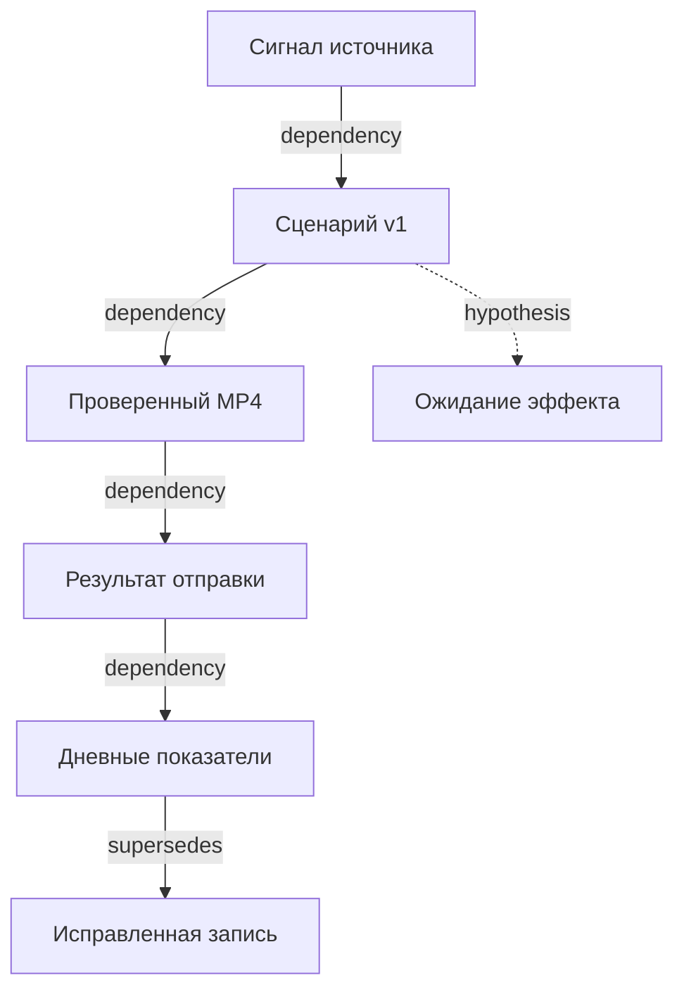

# Граф причин, пространства переходов и времени

RustClip хранит работу студии как переходы состояний с явными основаниями. Это позволяет увидеть ссылки сценария на известные источники, узнать, какая версия породила файл, что именно стояло в очереди и когда появились сведения о результате.

## Компоненты

| Модуль | Ответственность |
|---|---|
| `models` | Сценарии, сцены, версии проектов, артефакты, задания, события |
| `trends` | Ограниченные запросы к публичному RSS и официальному YouTube API |
| `generate` | Редактируемый оригинальный шаблон или локальный Ollama |
| `render` | Локальные FFmpeg/ffprobe, eSpeak/Piper, проверка итогового артефакта |
| `publish` | Проверенный пакет экспорта, YouTube/Telegram, YouTube Analytics |
| `money` | Валидация дневных приращений, расчёт прогноза и фактических сумм |
| `pipeline` | Последовательный ограниченный цикл: сигнал → черновик → рендер → доставка |
| `store` | Транзакции SQLite, состояния проектов/очереди, неизменяемый журнал |
| `graph` | Проверка целостности, граф с предками, исторический снимок |
| `server` / `main` | Локальный интерфейс, API, очередь и CLI |

Сервер слушает только `127.0.0.1`. Статические страницы встроены в бинарный файл. Материалы для монтажа задаются локальными относительными путями `assets/...`; загрузка удалённых видео или изображений в рендере не выполняется.

Эксклюзивная файловая блокировка удерживается владельцем `Store` до завершения процесса. Вторая студия или CLI-команда с той же папкой данных не запускается одновременно с сервером. Это исключает второй независимый владелец очереди; транзакции SQLite дополнительно защищают внутренние изменения состояния. Для работающей студии применяются интерфейс и API; перед CLI-командами с той же папкой сервер нужно остановить.

## Координаты перехода

Пространство здесь логическое: это область, в которой меняется объект, а не географическое положение компьютера.

| Координата | Поля и значение |
|---|---|
| Объект | `subject_id`: UUID проекта или `trend:<id>`; `space.subject` |
| Область | `spatial_scope` и `space.locus`: источник, локальная студия или внешняя операция |
| Площадка | `space.platform`, запрос задания и доказательства: YouTube, Telegram, экспорт |
| Версия | `space.project_revision`, `space.artifact_sha256`; ID артефакта в связанных данных |
| Геометрия | `space.profile`, `space.geometry`: выбранный профиль и размер кадра |
| Состояние | `from_state` → `to_state` |
| Время факта | `valid_at` |
| Время знания | `recorded_at` |
| Основание | `reason`, `parents`, `expected`, `observed`, `evidence`, `claim_level` |

`space` — необязательный объект явных координат события. Поля заполняются, когда соответствующие сведения известны; предполагаемый аккаунт площадки не выдумывается. Сценарий, артефакт, запрос и квитанция также сохраняются в данных перехода. В старых событиях отсутствие `space` сохраняет совместимость исходных хешей; новый просмотр не дописывает координаты задним числом.

Схема типичных зависимостей:



Здесь `dependency` указывает происхождение данных или необходимый вход операции. Стрелка публикация → показатели не устанавливает, почему люди посмотрели ролик. Гипотеза влияния сценария остаётся гипотезой, пока нет подходящих независимых наблюдений или эксперимента.

## Причинный порядок независим от часов

`parents` содержит ID, точный хеш и тип связи каждого предка. Поддерживаются `dependency`, `hypothesis`, `recovery`, `supersedes`. Эти ссылки задают частичный порядок предшествования **happened-before** между записями. Каждый родитель должен уже существовать в журнале; циклы, неизвестные родители и несовпадающие хеши отклоняются.

Настенные часы могут расходиться. Поздно полученный отчёт может описывать более ранний факт. Ни `valid_at`, ни `recorded_at`, ни `seq` сами по себе не создают причинную стрелку. В интерфейсе временная последовательность отображается отдельно от типизированных зависимостей.

Утверждения также типизированы: `OBSERVATION`, `DERIVED`, `MODEL_OUTPUT`, `HYPOTHESIS`, `CORRECTION`, `INTENT`. Выход модели не становится наблюдением только потому, что он записан в SQLite. Поле `confidence`, если присутствует, ограничено диапазоном 0–1 и не является вычисленной вероятностью успеха ролика.

## Два времени и исторические срезы

- `valid_at` — время, к которому относится наблюдение. Для тренда используется время получения сигнала; исходная дата источника сохраняется в доказательстве. Для дневных показателей используется конец выбранной даты UTC (`23:59:59Z`) как договорённость текущего хранилища.
- `recorded_at` — когда информация добавлена в локальный журнал.

`as_of` фильтрует по **времени знания** `recorded_at`. Срез содержит только сведения, записанные к границе, и доступных к ней предков. Поздний импорт статистики не появляется задним числом в более раннем срезе.

Проверка сначала охватывает весь глобальный журнал, затем строится выбранный вид. Если из-за временной границы отсутствует нужный родитель, граф возвращает `boundary_complete=false` и `missing_parent_ids`. Такая выборка не является полным причинным доказательством. Восстановление снимка при неполной границе завершается явной ошибкой.

`snapshot` ищет последнюю добавленную подходящую запись с `observed.project`. Поэтому можно увидеть старую ревизию сценария и исторический артефакт. Это чтение сохранённого состояния: сетевые запросы, создание файлов и публикация не запускаются.

```bash
cargo run --release -- graph --project PROJECT_UUID --as-of 2026-10-03T21:00:00Z
```

## Целостность и исправления

Каждое событие имеет последовательный `seq`, `previous_hash` предыдущей записи и `hash` канонического JSON. Ключи объектов сортируются рекурсивно, порядок массивов сохраняется. Триггеры SQLite запрещают обычные `UPDATE`/`DELETE` для таблицы событий. Проверяются последовательность, ссылки, типы и содержимое всех записей.

Эта цепочка обнаруживает несогласованные изменения локального журнала. **Хеши не являются подписью, удостоверением автора или доказательством правдивости наблюдения.** Владелец файла с полным доступом может переписать всю базу и пересчитать цепочку. Внешний подписанный журнал и независимое закрепление головы цепочки в этой версии не реализованы.

Исправление добавляет новую запись с `supersedes`; старая остаётся доступной. Правка сценария увеличивает `revision` и убирает текущую ссылку на прежний рендер. Повторный импорт дневной строки заменяет текущую интерпретацию по ключу `(project_id, platform, date, currency)`, сохраняя предыдущие значения в событиях.

## Операция, исполнение и очередь

`operation_id` обозначает логическую операцию, `execution_id` — конкретное исполнение; они различны. Для рендера и публикации логический ключ рассчитывается из проекта и входных данных. Записи очереди используют ID задания как ID исполнения. Повторный рендер после ошибки создаёт новое исполнение с тем же логическим ключом; работающий или уже успешный рендер переиспользуется.

Очередь публикации сохраняет точную ревизию, ID и SHA256 артефакта, площадку и параметры отправки. Перед запуском проверяются срок задания и текущая ревизия/хеш. Перед внешней отправкой создаётся отдельная копия файла и проверяется её SHA256. Устаревший запрос не может отправить новую версию под видом старой.

Идентичная активная или успешная заявка публикации дедуплицируется локально. После подтверждённой ошибки или отмены повторный явный запрос может создать новое исполнение той же операции. Состояние `unknown` не разрешает повторную отправку: нужно проверить фактическое состояние аккаунта. Интерфейс согласования такого результата в этой версии не реализован; тот же запрос возвращает прежнее неопределённое задание. Это не гарантия exactly-once со стороны площадки. Автоматических повторов внешней загрузки нет. При сетевом сбое после возможной отправки или перезапуске во время отправки результат сохраняется как неопределённый. Процесс не поддерживает автоматический refresh OAuth-токенов.

Сохранение сценария блокируется во время рендера и активной публикации. Поэтому запущенная отправка не может одновременно получить новую версию из редактора.

Очередь проверяется примерно каждые две секунды, пока выполняется `serve`. Студия не является системным сервисом и не продолжает работу после закрытия процесса. После перезапуска прерванный рендер отмечается ошибкой; ранее ожидавшие публикации обрабатываются, когда наступил их срок.

## Ограниченный автоконвейер

Один цикл сначала записывает намерение оператора с точной `PipelineConfig`, затем получает свежие сигналы. Созданные проекты ссылаются на намерение как на причинного предка. Порядок цикла: выбор новой темы → шаблон/локальная модель → новый проект → рендер с проверкой → проверочный экспорт или явно выбранный живой адаптер. Даже после успешного выполнения отчёт сохраняет `editable_draft=true`, `facts_verified=false` и отсутствие доказанного эффекта.

Ограничения проверяются до и между проектами: 1–3 за цикл, общий бюджет 1–10 за день, фиксированное UTC-смещение −12…+14. По умолчанию — один проект за цикл, два за календарный день UTC+3, интервал 60 минут, экспорт и `dry_run=true`. Бюджет считает ручные проекты и неудачные попытки тоже. Точные уже существующие темы повторно не создаются.

Сервер имеет один слот цикла и общий слот рендера: автоматизация выполняется последовательно и делит CPU с ручным рендером. `POST /api/pipeline/run` запускает один цикл асинхронно и возвращает принятие запроса; итог читается из `/api/state.pipeline`. `POST /api/pipeline/config` сохраняет `{enabled,config}` в `data/autopilot.json` и записывает намерение изменения политики. Повторные циклы работают в том же процессе, что интерфейс; срок следующего запуска отсчитывается от завершения предыдущего.

В CLI `pipeline ... --watch` используется тот же цикл. Он владеет папкой данных целиком; параллельный сервер с этой папкой запрещён. `Ctrl+C` просит завершиться после текущего ограниченного цикла. При ошибке верхнего уровня CLI-цикла автоматическое повторение прекращается с явной ошибкой. Поиск трендов, циклы и очередь не выполняются при выключенном процессе; расписание не развёрнуто в облаке и не является обещанием работы 24/7.

Импорт аналитики не включён в цикл: дневная экономика обновляется вручную, CSV или запросом YouTube Analytics через интерфейс/API.

## Наблюдаемый эффект и экономика

Google `popular_search` — сигнал поискового интереса с приблизительным объёмом. YouTube `most_popular_video` — попадание в выбранный чарт с накопленным счётчиком просмотров. Балл 0–100 смешивает логарифм объёма и затухание по времени только для сортировки; он не сравнивает одинаковые метрики разных платформ и не прогнозирует вирусность.

План ролика хранит `performance=unproven`. Дневные просмотры, оценка дохода платформы, подтверждённая выручка и расходы поступают в отдельный журнал. Формула RPM является допущением пользователя; оценка API не является выплатой. Импорт YouTube Analytics сначала объединяет уникальные подтверждённые ID видео одного проекта, включая старые ревизии, по дням. Повторный ID не увеличивает сумму дважды.

Связи с известными трендами создаются при совпадении сохранённого URL и темы сценария с заголовком сигнала. Это существенно для Google RSS: несколько запросов могут иметь один и тот же URL ленты. Такая связь сохраняет происхождение выбранной темы, а не доказательство её влияния на просмотры. Связать сигнал, сценарий и результат можно для исследования, но одно такое соответствие не доказывает влияние сценария на доход.

## Основные API

| Метод и маршрут | Назначение |
|---|---|
| `GET /api/state` | Проекты, сигналы, задания, показатели, доступность инструментов |
| `POST /api/trends/refresh` | Получить сигналы `{source,region}` |
| `POST /api/draft` | Создать проект из `GenerateRequest` |
| `POST /api/pipeline/run` | Запустить один цикл с `PipelineConfig` |
| `POST /api/pipeline/config` | Сохранить `{enabled,config}` повторных циклов |
| `POST /api/projects` | Создать проект из `ProjectSpec` |
| `PUT /api/projects/{id}` | Сохранить `{expected_revision,spec}` |
| `POST /api/projects/{id}/render` | Запустить рендер текущей версии |
| `POST /api/projects/{id}/publish` | Добавить `PublishRequest` в очередь |
| `POST /api/projects/{id}/analytics` | Импортировать дневную аналитику подтверждённых видео проекта |
| `POST /api/projects/{id}/hypothesis` | Записать `{reason}` как гипотезу |
| `GET /api/graph?project_id=...&as_of=...` | Читать граф и границу доказательств |
| `GET /api/projects/{id}/snapshot?as_of=...` | Читать исторический снимок проекта |
| `POST /api/ledger` / `/api/ledger/import` | Ручные строки / CSV |
| `POST /api/assets` | Локальные материалы через multipart `file` |
| `POST /api/jobs/{id}/cancel` | Отменить ожидающее задание публикации |

Типы и ограничения JSON определены в `src/models.rs`, `src/generate.rs`, `src/publish.rs`, `src/money.rs`. Сервер ограничивает тело запроса и отклоняет изменения из чужого браузерного origin. Публичная многопользовательская установка с управлением доступом в текущую версию не входит.
