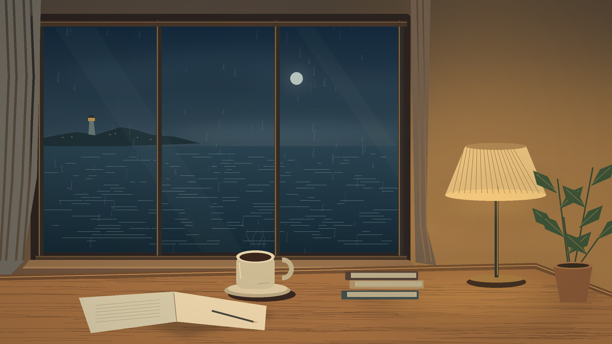

# «Вечер у моря»: проверенный двухчасовой выпуск

[Посмотреть первые 60 секунд](preview.mp4). Полный мастер: 7200,125 секунды, 1280×720, 16 fps, стерео AAC 192 kbps; 406 986 781 байт. Его хеш: `8b7936cfe82bfd56ed0a3faa31af29b5787bfba7d0920e893ef22de147c204f1`.

Это спокойное синтезированное электропианино с басом и атмосферной подложкой. Партитура содержит 8 198 событий и 24 пятиминутные главы. Второй час отличается от первого, готовая запись не дублируется. Иллюстрация комнаты у моря повторяет бесшовный 90-секундный визуальный цикл.

## Что подтверждено

| Протокол | Проверка |
|---|---|
| [verification.json](verification.json) | Полное декодирование MP4, длительность, пик, кодеки, хеши генераторов |
| [independent-rust-verification.json](independent-rust-verification.json) | Rust `graph::verify`; хеш MP4 совпадает с метаданными и причинным событием |
| [causal-graph.json](causal-graph.json) | 5 запечатанных событий с явными зависимостями, состояниями, областью и временем |
| [music-verification.json](music-verification.json) | Мастер: −19,00 LUFS, true peak −2,00 dBTP; clipping 0 |
| [pcm-verification.json](pcm-verification.json) | Прочитаны все 317 520 000 кадров PCM на канал, длительность 7200,000 s; 7200 разных односекундных блоков |
| [score-verification.json](score-verification.json) | Партитуры первого и второго часа различаются |
| [visual-verification.json](visual-verification.json) | Первый кадр следующего цикла совпадает с первым; мягкий переход через границу |

Вместе с Rust CLI прошли 73 проверки: 70 библиотечных тестов, 1 тест CLI и 2 реальных FFmpeg-теста. Эти проверки подтверждают работу кода и файлов; художественное качество оценивают прослушиванием. Просмотры, публикация в YouTube и доходы не заявлены.

[Инструкция сборки и ограничения](../../docs/relax.md), [черновик названия, описания и глав YouTube](youtube-upload.txt). Мастер большого размера не хранится в Git; здесь небольшой предпросмотр и воспроизводимые исходники.
